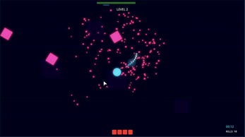
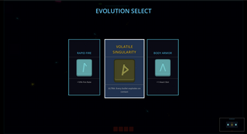
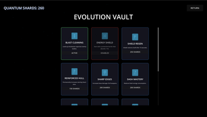
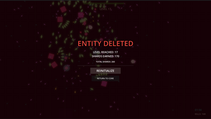

# Polygon Protocol

<p align="center">
  
</p>

<p align="center">
  <strong>Evolve. Dash. Survive.</strong>
</p>

<p align="center">
  A fast-paced geometric roguelite built in Godot where your shape is your weapon.
  Start as a fragile circle, carve through corrupted swarms, evolve into deadlier polygons,
  and break massive boss encounters by dashing into their exposed hearts.
</p>

<p align="center">
  <a href="https://kirilp.itch.io/polygon-protocol"></a>
  <a href="https://github.com/Kiril-P/Polygon-Protocol"></a>
</p>

<p align="center">
  
  
  
  
</p>

Polygon Protocol is a score-chasing survival game set in a hostile digital void. Every run pushes you to manage dash energy, route enemies cleanly, survive escalating waves, and build toward a form powerful enough to handle its boss fights. What starts as a minimalist arcade survival game quickly opens into build decisions, permanent upgrades, and a tighter risk/reward loop around movement and invulnerability.

Built in **Godot 4.5**, the project blends bullet hell pressure, dash-based aggression, objective-driven bosses, online leaderboard support, and a neon geometric presentation. It began as a **Mini Jam 202: Power-up** submission and has since expanded into a fuller standalone project.

## Why It Hits

- **Shape evolution changes combat**: start as a circle, then evolve into multi-sided forms that add more firing angles and turn movement into offense.
- **Dash-first survival**: your dash is both escape tool and kill tool, with invulnerability during use and an energy economy that forces commitment.
- **Build variety every run**: level-up choices can push you toward faster fire, harder hits, bounce tech, gravity pull, explosive shots, or continuous beam play.
- **Bosses with actual mechanics**: Fortress and Pulsar are not simple health sponges. You need to hunt vulnerable boss hearts and break the pattern under pressure.
- **Meta progression that matters**: earn Quantum Shards, spend them in the Evolution Vault, and unlock permanent upgrades that change future runs.
- **Competitive layer**: local high scores and online leaderboard uploads are supported through SilentWolf integration.

## Screenshot Gallery

| Combat | Evolution Select |
| --- | --- |
|  |  |

| Evolution Vault | Death Screen |
| --- | --- |
|  |  |

## Core Loop

1. Enter the arena as a vulnerable base form.
2. Clear enemy waves while balancing movement, positioning, and dash energy.
3. Level up mid-run and pick upgrades that shape your build.
4. Evolve into stronger polygon forms with broader firing coverage.
5. Beat boss phases, collect shards, and invest them into permanent progression.
6. Come back stronger and push for a higher score, longer survival time, and cleaner runs.

## Controls

- `Move`: `WASD` or mouse movement
- `Dash`: `Space` or left click
- `Pause`: `Esc`
- `Preferences`: controls, tutorial toggle, audio, and difficulty can all be changed in the in-game options menu

## Play It

- **Browser / desktop builds**: [Polygon Protocol on itch.io](https://kirilp.itch.io/polygon-protocol)
- **Platforms currently exported in this repo**: `HTML5`, `Windows`, and `macOS`

## Run Locally

1. Install **Godot 4.5**.
2. Clone this repository.
3. Open `project.godot` in Godot.
4. Press `F5` to run the project.

Export presets are already configured for:

- `Web`
- `Windows Desktop`
- `macOS`

## Project Structure

```text
addons/    Third-party plugins, including SilentWolf leaderboard support
assets/    Art, particles, UI resources, shaders, and imported packs
build/     Exported builds for web and desktop
scenes/    Menus, gameplay scenes, enemies, UI, and progression screens
scripts/   Core gameplay logic, bosses, player systems, upgrades, HUD, and persistence
```

## Tech Notes

- **Engine**: Godot `4.5`
- **Primary loop**: top-down survival shooter with roguelite progression
- **Persistence**: local save data for settings, progression, and personal bests
- **Leaderboard service**: SilentWolf for online score submission and retrieval
- **Input support**: keyboard or mouse-driven movement with shared dash input

## Roadmap Direction

- More enemy combinations and late-run pressure tuning
- More upgrade interactions and stronger build identities
- Continued boss iteration and endgame polish
- Better presentation around runs, progression, and score-chasing feedback

## Repo Purpose

This repository contains the source for Polygon Protocol, including gameplay systems, progression logic, exported builds, and the current structure used to keep expanding the game. If you want to follow development, play the latest public build, or inspect how the systems are put together in Godot, this is the place.
